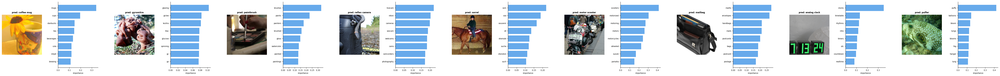
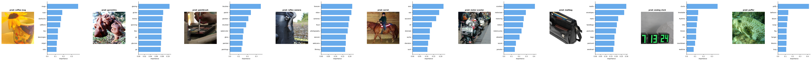

# CENG 502 — Reproduction of U-F²-CBM

> **Paper:** *CLIP-Free, Label-Free, Unsupervised Concept Bottleneck Models* — Sammani et al., 2026  
> **Course:** CENG 502, Middle East Technical University  
> **Implementation from scratch** — no official code was used.

---

## What is U-F²-CBM?

U-F²-CBM converts **any frozen pretrained visual classifier** into an interpretable Concept Bottleneck Model without:
- CLIP
- Labels
- Supervised training of the concept-to-class classifier

It works in two stages:

**Stage 1 — TextUnlock:** A lightweight MLP is trained via knowledge distillation to project visual features into a shared text embedding space.

**Stage 2 — CBM Construction (no training):** 20K English words are encoded as concepts, and an unsupervised concept-to-class weight matrix is built purely from text-to-text similarity.

---

## Results

### Main Results (ImageNet Validation)

| Backbone | Weights | Original | TextUnlock | U-F²-CBM |
|---|---|---|---|---|
| Paper — ResNet50 | V1 | 76.13% | 75.80% | 73.90% |
| **Ours — ResNet50** | **V1** | **76.15%** | **74.96%** | **72.28%** |
| Paper — ResNet50 | V2 | 80.34% | 80.14% | 78.10% |
| **Ours — ResNet50** | **V2** | **80.33%** | **79.69%** | **77.53%** |
| Paper — ViT-B/16 | V1 | 81.07% | 80.70% | 79.30% |
| **Ours — ViT-B/16** | **V1** | **81.07%** | **80.45%** | **78.66%** |

### MLP Ablation (ResNet50 V2 — same protocol as Paper Appendix Table 2)

| Ablation | CBM Top-1 |
|---|---|
| Full model (trained MLP) | 77.53% |
| Mean feature input | 0.10% |
| Random feature input | 0.09% |
| Shuffled features | 14.74% |
| Random MLP weights | 0.09% |

See [detailed_results.md](detailed_results.md) for full details including training curves, per-epoch tables, ablation analysis, and comparison with CLIP-based baselines.

---

## Concept Visualizations

**ResNet50**



**ViT-B/16**



---

## Repository Structure

```
CENG_502_project/
├── uf2cbm/                        # Main implementation package
│   ├── models/
│   │   ├── backbones.py           # Visual backbone wrappers (12 torchvision models)
│   │   └── text_unlock.py         # TextUnlock MLP + text encoder utilities
│   ├── data/
│   │   ├── imagenet_dataset.py    # ImageNet loader + soft-label cache builder
│   │   └── concept_words.py       # 20K word list + WordNet filtering
│   ├── training/
│   │   └── train_text_unlock.py   # Training loop (KD loss, AMP, cosine LR)
│   ├── cbm/
│   │   ├── concept_bank.py        # ConceptBank: C and W_con build/save/load
│   │   └── uf2cbm_model.py        # Full CBM inference module
│   └── utils/
│       ├── metrics.py             # Evaluation helpers
│       └── visualization.py       # Concept importance plots
├── train_text_unlock.py           # Training entry point
├── build_concept_bank.py          # Concept bank construction entry point
├── evaluate.py                    # Evaluation entry point (+ ablation modes)
├── visualize_concepts.py          # Qualitative concept analysis
├── compile_results.py             # Print full results comparison table
├── configs/
│   └── default.yaml               # Default hyperparameters
├── figures/                       # Concept visualization figures
├── requirements.txt
└── detailed_results.md            # Full reproduction report with training curves and analysis
```

---

## Setup

```bash
# Create conda environment
conda create -n uf2cbm python=3.11 -y
conda activate uf2cbm

# Install dependencies
pip install -r requirements.txt

# Download NLTK WordNet (needed for concept filtering)
python -c "import nltk; nltk.download('wordnet')"
```

**ImageNet:** Place the ImageNet dataset with `train/` and `validation/` subdirectories:
```
/path/to/imagenet/
├── train/
│   ├── n01440764/   # synset dirs
│   └── ...
└── validation/
    ├── n01440764/
    └── ...
```

---

## Running the Reproduction

### Step 1 — Train TextUnlock MLP (~21h per backbone)

```bash
# ResNet50 with V2 weights (default)
python train_text_unlock.py \
    --backbone        resnet50 \
    --imagenet_train  /path/to/imagenet/train \
    --imagenet_val    /path/to/imagenet/validation \
    --checkpoint_dir  ./checkpoints/resnet50

# ResNet50 with V1 weights (direct paper comparison)
python train_text_unlock.py \
    --backbone        resnet50_v1 \
    --imagenet_train  /path/to/imagenet/train \
    --imagenet_val    /path/to/imagenet/validation \
    --checkpoint_dir  ./checkpoints/resnet50_v1

# ViT-B/16
python train_text_unlock.py \
    --backbone        vit_b_16 \
    --imagenet_train  /path/to/imagenet/train \
    --imagenet_val    /path/to/imagenet/validation \
    --checkpoint_dir  ./checkpoints/vit_b_16
```

### Step 2 — Build Concept Bank (~30 min)

```bash
python build_concept_bank.py \
    --backbone   resnet50 \
    --mlp_ckpt   ./checkpoints/resnet50/best.pth \
    --save_dir   ./concept_bank
```

### Step 3 — Evaluate (~1h)

```bash
python evaluate.py \
    --backbone     resnet50 \
    --mlp_ckpt     ./checkpoints/resnet50/best.pth \
    --concept_bank ./concept_bank/resnet50 \
    --imagenet_val /path/to/imagenet/validation \
    --output_json  ./results/resnet50_results.json
```

### Step 4 — MLP Ablation Study (~3h)

```bash
# Run all 4 ablation modes
for ABLATION in mean_feat random_feat shuffled_feat random_weights; do
    python evaluate.py \
        --backbone     resnet50 \
        --mlp_ckpt     ./checkpoints/resnet50/best.pth \
        --concept_bank ./concept_bank/resnet50 \
        --imagenet_val /path/to/imagenet/validation \
        --ablation     $ABLATION \
        --output_json  ./results/resnet50_ablation_${ABLATION}.json
done
```

### Step 5 — Visualize Concepts (~10 min)

```bash
python visualize_concepts.py \
    --backbone     resnet50 \
    --mlp_ckpt     ./checkpoints/resnet50/best.pth \
    --concept_bank ./concept_bank/resnet50 \
    --imagenet_val /path/to/imagenet/validation \
    --output_dir   ./figures/resnet50
```

### Step 6 — Compile Results Table

```bash
python compile_results.py           # main results
python compile_results.py --ablation  # include ablation
```

---

## Key Implementation Details

| Component | Detail |
|---|---|
| Text encoder | `all-MiniLM-L12-v1` (384-dim) |
| Concept set | Google 20K English words, WordNet-filtered → 15,121 concepts |
| MLP architecture | `Linear(n→2n)→LN→GELU→Dropout(0.5) / Linear(2n→2n)→LN→GELU / Linear(2n→384)` |
| Training | 30 epochs, Adam lr=1e-4, cosine decay, batch 256, grad clip 1.0 |
| Soft-label cache | float16 `.npz` (~2 GB per backbone), avoids re-running backbone each epoch |
| KD loss | `-(o * log_softmax(f̃ @ U^T)).sum(dim=-1).mean()` |

---

## Citation

```bibtex
@article{sammani2026uf2cbm,
  title={CLIP-Free, Label-Free, Unsupervised Concept Bottleneck Models},
  author={Sammani, Fawaz and others},
  year={2026}
}
```
